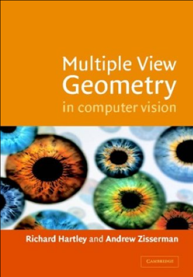
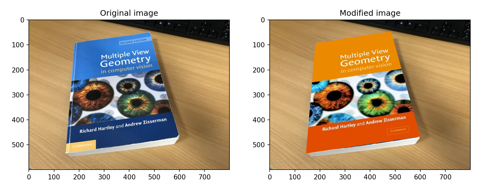
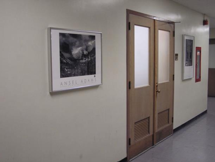
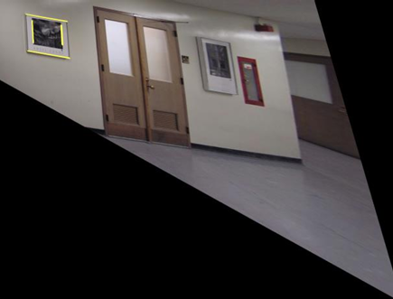
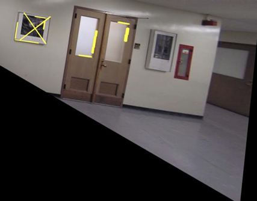

# Metric Rectification and Robust Homography

## Overview

This repository implements computer vision techniques, including metric rectification, homography estimation using the Random Sample Consensus (RANSAC) algorithm, image warping with the homography matrix, and panoramic view generation using the computed homography.

## Image Wraping:

The objective was to map the template image onto the original image using the computed homography matrix. The backward interpolation method was implemented for this transformation.

**Figure:** Template Image

**Figure:** Output after image wraping

## Metric Rectification:

Metric rectification involves eliminating projective and affine distortions from an image. The goal was to implement two metric rectification methods: the Two-Step (Stratified) approach and the One-Step approach.

**Figure:** Source Image

### 1. Two step approach:

In this approach, projective distortion is removed by identifying the line at infinity. Once the homography matrix Hp is computed, backward interpolation is applied to obtain the affinely rectified image.

The second step eliminates affine distortion by determining Ha, which is derived from the dual of the conic at infinity. To compute this conic, at least two pairs of orthogonal lines are required to determine Ha.

**Figure:** Removal of Projective distortion. Affinely rectified image

**Figure:** Removal of Affine distortion. Metric rectification